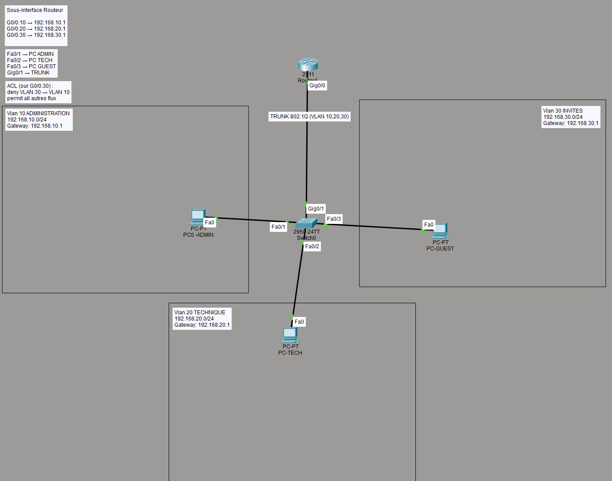
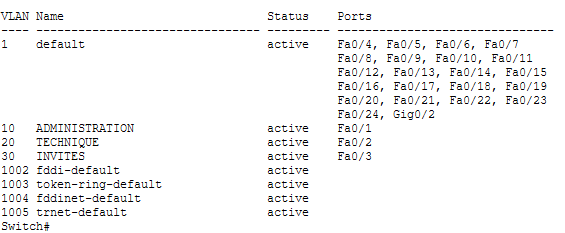
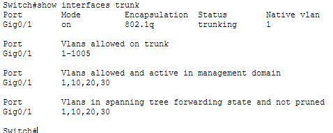
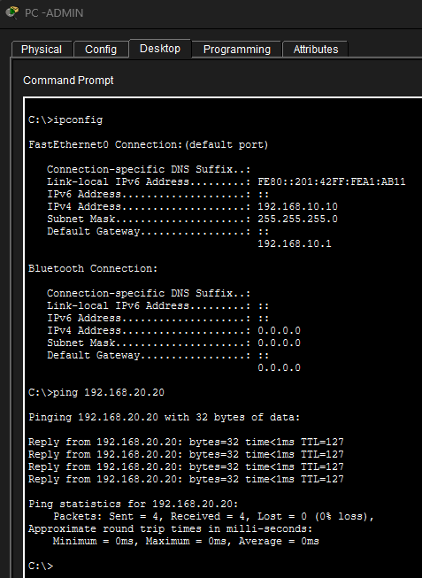
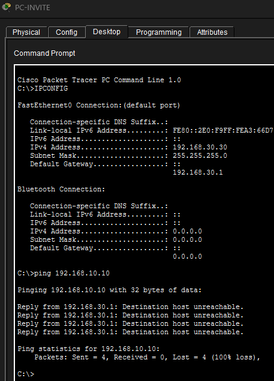
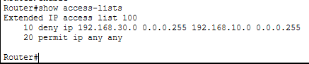
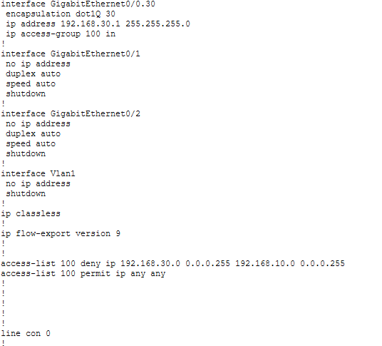

# TP-Cisco-Vlan-Routing
Projet TSSR : mise en place de VLAN et routage inter-VLAN avec sécurisation via ACL

# Segmentation réseau Cisco – VLAN & Routage Inter-VLAN

## Contexte
Dans le cadre de ma formation TSSR, j’ai réalisé un projet de segmentation réseau inspiré d’une situation professionnelle.  
Une PME souhaitait améliorer la sécurité et l’organisation de son réseau en séparant les services.

---

## Objectifs
- Mettre en place des VLAN pour segmenter le réseau
- Configurer le routage inter-VLAN
- Sécuriser les communications avec une ACL

---

## Environnement technique
- Simulation : Cisco Packet Tracer
- Équipements :
  - 1 switch
  - 1 routeur
  - 3 postes clients

---

## Plan d’adressage

| VLAN | Nom    | Réseau            |
|------|--------|------------------|
| 10   | ADMIN  | 192.168.10.0/24  |
| 20   | TECH   | 192.168.20.0/24  |
| 30   | GUEST  | 192.168.30.0/24  |

---

## Architecture réseau

---

## Réalisation

### 🔹 Configuration du switch
- Création des VLAN
- Affectation des ports
- Mise en place d’un trunk 802.1Q

### 🔹 Configuration du routeur
- Création de sous-interfaces
- Encapsulation dot1Q
- Routage inter-VLAN

### 🔹 Sécurisation
- Mise en place d’une ACL
- Blocage du VLAN GUEST vers VLAN ADMIN

---

## Tests de fonctionnement

### ✔ Communication autorisée
- ADMIN ↔ TECH
- TECH ↔ GUEST

### ❌ Communication bloquée
- GUEST → ADMIN

---

## Preuves

### VLAN

### Trunk

### Ping OK

### Ping bloqué (ACL)

---

## Vérification de la configuration ACL

### Liste de contrôle d'accès

### Application de l'ACL sur l'interface

---

## Résultats

Le réseau est correctement segmenté grâce aux VLAN.  
Le routage inter-VLAN permet la communication entre services autorisés.  
Les règles de sécurité (ACL) empêchent les accès non autorisés.

---

## Compétences mises en œuvre

- Configuration VLAN (Cisco)
- Trunk 802.1Q
- Routage inter-VLAN (Router-on-a-Stick)
- Mise en place d’ACL
- Diagnostic réseau

---

